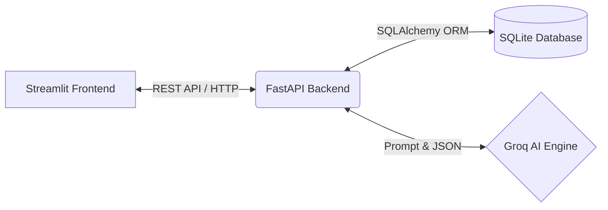
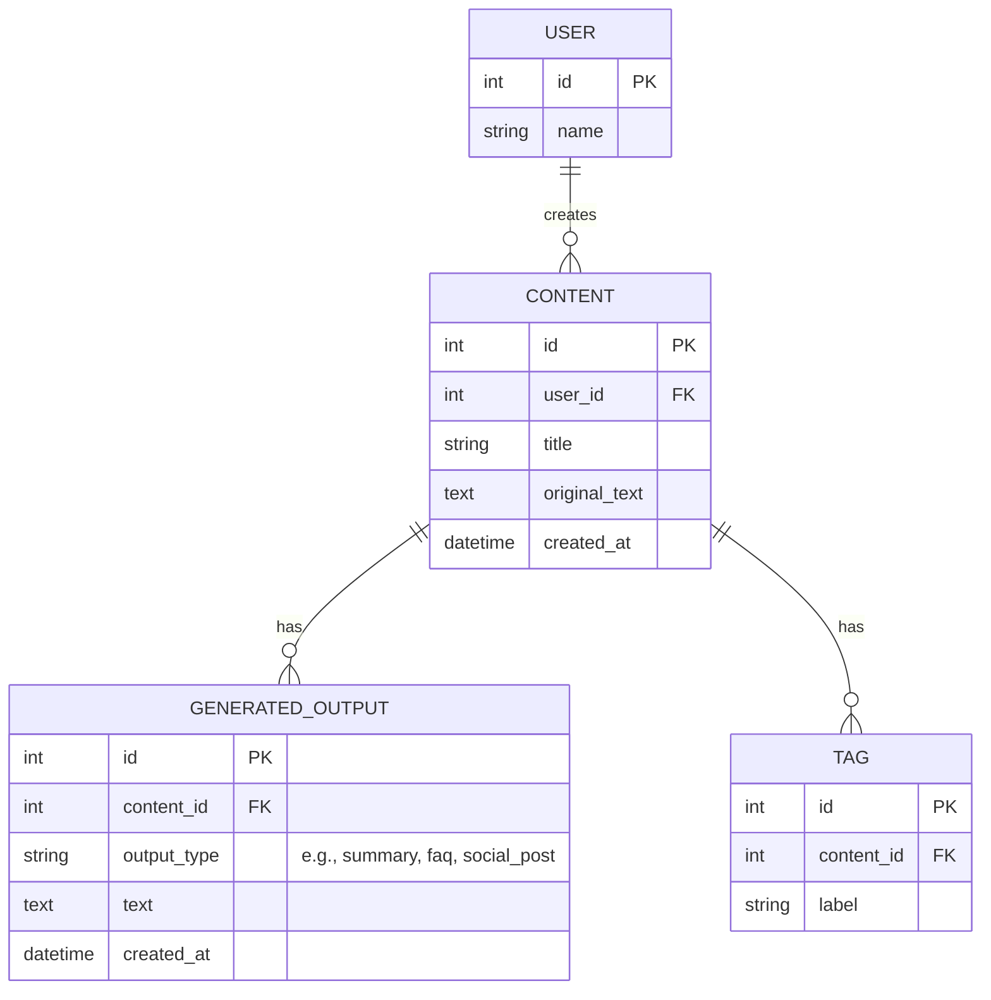

# Project Report: Content Intelligence Platform

## 1. Executive Summary
The **Content Intelligence Platform** is a lightweight, AI-assisted web application designed to accelerate content marketing and management workflows. Built as a Hackathon MVP, the platform allows teams to paste long-form textual content (such as articles, reports, or announcements) and leverage generative AI to instantly extract insights (summaries, keywords, topics) and repurpose the text into alternate formats (FAQs, social media posts, email summaries, and press releases). 

The project prioritizes a "Human-in-the-Loop" (HITL) approach, ensuring all AI-generated outputs are reviewed and editable by the user before being permanently saved.

---

## 2. Problem Statement & Solution
**The Problem:** Content and marketing teams spend a disproportionate amount of time manually analyzing documents, extracting key themes, assigning metadata (tags/categories), and rewriting the same core information into various formats for different distribution channels.

**The Solution:** An intuitive, low-code platform that centralizes the source text and uses high-speed Large Language Models (LLMs) to automate the analysis and transformation phases, reducing a multi-hour workflow down to a few seconds, while maintaining human editorial control.

---

## 3. Project Architecture
The application follows a decoupled, modern web architecture optimized for rapid development and high performance.

### Technology Stack
*   **Frontend (UI Layer):** **Streamlit (Python).** Chosen for its rapid prototyping capabilities, allowing us to build a multi-page, stateful, and interactive web interface entirely in Python without writing custom React/HTML/CSS boilerplate.
*   **Backend (API Layer):** **FastAPI.** Provides a highly performant, auto-documenting REST API. It handles data validation (via Pydantic), routing, and business logic orchestration.
*   **Database Layer:** **SQLite.** Used for zero-configuration, lightning-fast local storage, perfectly suited for an MVP. Easily swappable to PostgreSQL for production deployment.
*   **ORM:** **SQLAlchemy.** Abstracts SQL queries into Python objects, ensuring robust relational data integrity.
*   **AI Engine:** **Groq API.** Powers the intelligence layer using the ultra-low latency `qwen/qwen3.8-27b` model. Selected over traditional NLP libraries (like NLTK/spaCy) because a single LLM prompt can accurately handle summarization, keyword extraction, and stylistic rewriting simultaneously.

---

## 4. Engineering Approach & Business Rules

### Human-in-the-Loop (HITL) Design
A core requirement of the project was that AI should *assist*, not *replace*, human judgment. 
*   **Implementation:** When a user clicks "Run AI Analysis", the backend processes the text and returns the data to the frontend in a **preview state**. The data is *not* saved to the database. The user must proceed to the "Review & Edit" screen, make necessary manual adjustments to the AI's draft, and explicitly click "Save to Database".

### Non-Destructive Source Management
*   **Implementation:** The original pasted text is treated as immutable source truth. It is stored securely in the `original_text` column of the `Content` table. All AI-generated summaries and transformations are stored as separate rows in a `GeneratedOutput` table linked via foreign keys. This guarantees the source material is never accidentally overwritten by an AI hallucination.

### Single-Pass Structured Extraction
*   **Implementation:** Instead of making 5 separate API calls to get a summary, key points, keywords, topics, and tags, the backend uses **Structured JSON Prompting**. It instructs the AI to return all five dimensions in a single strictly-formatted JSON object. This drastically reduces latency and API costs.

---

## 5. Data Model (Entity Relationship)

The relational schema is designed to be minimal yet flexible enough to support future scaling.

---

## 6. User Interface & Workflow
The Streamlit frontend is organized into 6 distinct views accessible via a sidebar navigation menu:

1.  **📝 New Content:** The entry point. Users input their identity, paste their source material, provide a title, and save.
2.  **🤖 AI Processing:** The extraction engine. Users trigger the LLM to read the content and present a live preview of the extracted metadata (Summary, Key Points, Topics, Keywords, Suggested Tags).
3.  **✏️ Review & Edit:** The editorial phase. Users can refine the AI's raw output in text areas before persisting it to the database.
4.  **🔄 Transform:** The repurposing engine. Users select a target format (FAQ, Social Post, Email, Press Release) and generate ready-to-publish derivative content.
5.  **📚 Content History:** A dashboard displaying all previously saved content cards associated with the current user.
6.  **🔍 Content Detail:** A comprehensive view of a single content item, showing the original text alongside all saved AI outputs and manual tags.

---

## 7. Future Enhancements (Beyond MVP)
While the current build strictly adheres to the MVP constraints, the architecture supports several natural extensions:
*   **Production Database:** Swap SQLite for PostgreSQL by changing the `DATABASE_URL` environment variable.
*   **Authentication:** Replace the simple username field with OAuth2 / JWT-based login flows.
*   **File Parsing:** Integrate libraries like `PyPDF2` or `python-docx` to allow users to upload files directly instead of copy-pasting.
*   **Webhooks:** Add outbound API calls to directly push finalized Social Posts or Emails to platforms like Hootsuite or Mailchimp.
